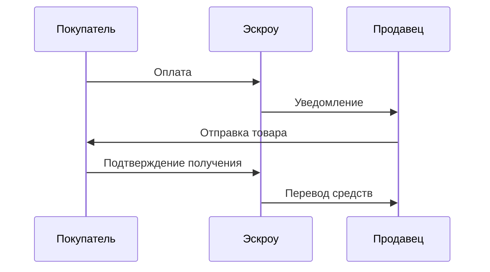

  
  
  

# 🔐 Mega SB: Все о самом крупном маркетплейсе в тор

В мире даркнета существует множество маркетплейсов, но **Mega SB** выделяется среди них своей масштабностью и популярностью.

Этот маркетплейс предлагает широкий ассортимент товаров и услуг, обеспечивая анонимность и безопасность для пользователей.

Пользователи ценят _Mega SB_ за его надежность и удобство использования.

В этом разделе мы расскажем об особенностях и значимости этого маркетплейса.

---

## 📑 Содержание

| Раздел | Описание |
|--------|----------|
| [✨ Ключевые выводы](#-ключевые-выводы) | Главные тезисы обзора |
| [🌐 Что такое Mega SB](#-что-такое-mega-sb-и-почему-о-нем-говорят) | Введение в платформу |
| [⚙️ Как устроен маркетплейс](#️-как-устроен-маркетплейс-mega-sb) | Доступ и компоненты |
| [🛡️ Безопасный доступ](#️-безопасный-доступ-к-mega-sb) | Tor, VPN, рекомендации |
| [📝 Регистрация и верификация](#-регистрация-и-верификация-на-площадке) | 2FA, восстановление |
| [🖥️ Интерфейс](#️-особенности-интерфейса-mega-sb) | Элементы и навигация |
| [🔒 Система безопасности](#-система-безопасности-на-mega-sb) | Шифрование, крипто |
| [💰 Финансовые операции](#-финансовые-операции-на-платформе-mega-sb) | Bitcoin, Monero |
| [📦 Эскроу и гарантии](#-система-эскроу-и-гарантии-на-mega-sb) | Как работает эскроу |
| [⚖️ Сравнение с другими](#️-сравнение-mega-sb-с-другими-площадками-даркнета) | Конкуренты |
| [💬 Поддержка](#-поддержка-пользователей-на-mega-sb) | Чат, форумы |
| [📋 Правила и политика](#-правила-и-политика-mega-sb) | Ограничения |
| [⚠️ Риски](#️-риски-использования-mega-sb) | Угрозы и митигация |
| [🚀 Будущее развития](#-будущее-развитие-платформы-mega-sb) | Планы платформы |
| [⭐ Отзывы](#-отзывы-пользователей-о-работе-с-mega-sb) | Опыт пользователей |
| [✅ Заключение](#-заключение) | Итоги |
| [❓ FAQ](#-faq) | Частые вопросы |

---

### ✨ Ключевые выводы

- **Mega SB** - крупнейший маркетплейс в даркнете.
- Предлагает широкий ассортимент товаров и услуг.
- Обеспечивает анонимность и безопасность для пользователей.
- Популярность среди пользователей даркнета.
- Надежность и удобство использования.

---

## 🌐 Что такое Mega SB и почему о нем говорят

**Mega SB** - это маркетплейс, функционирующий исключительно через сеть Tor, что делает его привлекательным для пользователей, ищущих анонимность. Этот **мега маркетплейс даркнет** обеспечивает высокий уровень безопасности и конфиденциальности для своих пользователей.

Платформа предлагает широкий ассортимент товаров и услуг, недоступных в обычных онлайн-магазинах. Пользователи могут найти все, от редких товаров до уникальных услуг, соблюдая при этом анонимность благодаря сети Tor.

**Mega SB** завоевал популярность среди пользователей даркнета благодаря своей надежности и безопасности. Платформа постоянно совершенствует свои меры безопасности, чтобы защитить пользователей от различных угроз.

Пользователи ценят _площадка мега даркнет_ за ее удобный интерфейс и широкий выбор товаров и услуг. Кроме того, платформа обеспечивает надежную систему обратной связи, позволяя пользователям оценивать продавцов и их товары.

В целом, Mega SB является одним из наиболее популярных и безопасных маркетплейсов даркнета, предлагая пользователям уникальный опыт покупок в анонимной среде.

---

## ⚙️ Как устроен маркетплейс Mega SB

Доступ к маркетплейсу Mega SB осуществляется через сеть Tor, что обеспечивает высокий уровень безопасности и анонимности. Для начала работы пользователям необходимо использовать специальный браузер, такой как Tor Browser, который позволяет получить доступ к сайту через **mega даркнет ссылка**.

После установки браузера, пользователи могут зайти на _mega сайт даркнет_ и начать взаимодействие с платформой. Процесс регистрации включает в себя создание учетной записи и подтверждение личности для обеспечения безопасности.

#### 📺 Видеоматериал

Mega SB использует передовые технологии шифрования для защиты данных пользователей. Это позволяет обеспечить конфиденциальность и безопасность всех операций, проводимых на платформе.

#### 🔐 Основные компоненты безопасности Mega SB

- Шифрование данных
- Анонимный доступ через Tor
- Система верификации пользователей

📊 Таблица: Компоненты безопасности

| Компонент | Описание |
| --- | --- |
| Шифрование данных | Защита данных пользователей с помощью передовых алгоритмов шифрования |
| Анонимный доступ | Использование сети Tor для анонимного доступа к платформе |
| Система верификации | Верификация пользователей для предотвращения мошенничества |

Чтобы зайти на Mega SB, пользователям необходимо знать актуальную **mega даркнет ссылка**, так как ссылки могут изменяться из-за блокировок. Следуя этим шагам, пользователи могут безопасно и анонимно взаимодействовать с маркетплейсом.

---

## 🛡️ Безопасный доступ к Mega SB

Mega SB обеспечивает безопасный доступ для своих пользователей с помощью передовых технологий безопасности. Для того чтобы получить доступ к платформе, необходимо использовать **Tor Browser**, который позволяет сохранить анонимность и защитить данные пользователей.

Для начала, необходимо скачать и установить _Tor Browser_ с официального сайта. После установки, запустите браузер и дождитесь подключения к сети Tor. Это может занять несколько минут.

Дополнительным шагом для повышения безопасности является использование **VPN**. VPN шифрует интернет-соединение, делая его еще более безопасным. Ниже представлена таблица сравнения популярных VPN-сервисов.

| VPN Сервис | Безопасность | Скорость | Цена |
| --- | --- | --- | --- |
| ExpressVPN | Высокая | Быстрая | Средняя |
| NordVPN | Высокая | Быстрая | Низкая |
| CyberGhost | Средняя | Средняя | Низкая |

После настройки Tor Browser и VPN, пользователи могут безопасно получить доступ к **зеркала мега даркнет** и другим сервисам Mega SB. Важно помнить, что безопасность зависит не только от используемых инструментов, но и от осторожности самих пользователей.

Для получения актуальной **mega ссылка на сайт даркнет**, рекомендуется следить за официальными источниками и новостными каналами Mega SB.

Следуя этим рекомендациям, пользователи могут обеспечить себе безопасный и анонимный доступ к платформе Mega SB. Не стоит забывать о постоянном обновлении используемых инструментов безопасности и следить за новостями от Mega SB.

---

## 📝 Регистрация и верификация на площадке

Mega SB требует регистрации и верификации для обеспечения безопасности пользователей. Процесс регистрации на **мега даркнет официальный** включает несколько простых шагов, которые необходимо выполнить для начала работы на платформе.

Для регистрации на _mega даркнет маркет_, пользователям необходимо предоставить некоторую базовую информацию. После регистрации следует процесс верификации, который включает проверку предоставленной информации для обеспечения безопасности и целостности данных.

#### 🔑 Настройка 2FA

Одним из важных шагов после регистрации является настройка двухфакторной аутентификации (2FA). Это добавляет дополнительный уровень безопасности к вашему аккаунту на **магазин мега даркнет**, защищая его от несанкционированного доступа.

#### 🔓 Восстановление доступа

В случае утери доступа к аккаунту, процесс восстановления включает несколько шагов для верификации личности пользователя. Это обеспечивает, что только законный владелец аккаунта сможет восстановить доступ к своему аккаунту на Mega SB.

📋 Таблица: Функции регистрации на Mega SB

| Функция | Описание | Преимущества |
| --- | --- | --- |
| Регистрация | Простая форма регистрации | Быстрый доступ к платформе |
| Верификация | Проверка предоставленной информации | Повышенная безопасность |
| 2FA | Двухфакторная аутентификация | Дополнительный уровень защиты |

Регистрация и верификация на Mega SB - это ключевые шаги для начала работы на платформе. Следуя простым инструкциям и настраивая дополнительные меры безопасности, пользователи могут быть уверены в безопасности своего аккаунта.

---

## 🖥️ Особенности интерфейса Mega SB

Одним из ключевых преимуществ Mega SB является его простой и функциональный интерфейс. Маркетплейс **Mega SB** разработан с учетом потребностей пользователей, обеспечивая комфортное использование.

Пользователи ценят _Mega SB_ за его интуитивно понятный дизайн, позволяющий легко находить нужные товары и услуги. Интерфейс платформы обеспечивает быстрый доступ к основным функциям, таким как поиск товаров, управление заказами и взаимодействие с продавцами.

| Элемент интерфейса | Функциональность |
| --- | --- |
| Поиск товаров | Позволяет пользователям быстро находить нужные товары и услуги по ключевым словам или категориям. |
| Меню категорий | Упрощает навигацию по различным разделам маркетплейса, помогая пользователям находить нужные разделы. |
| Личный кабинет | Предоставляет доступ к управлению заказами, истории покупок и настройкам профиля пользователя. |

Использование **триппа сниппа даркнет mega** и других функций маркетплейса становится проще благодаря продуманному интерфейсу. Пользователи могут легко найти **mega даркнет ссылка** и перейти на нужные страницы.

В целом, интерфейс **сайт мега даркнет** обеспечивает пользователям комфортные условия для покупок и взаимодействия с платформой.

---

## 🔒 Система безопасности на Mega SB

Платформа Mega SB реализует многоуровневую систему безопасности, чтобы защитить пользователей и их данные. Одним из ключевых элементов этой системы является **шифрование данных**, которое обеспечивает конфиденциальность и целостность информации, передаваемой между пользователями и платформой.

Кроме того, Mega SB использует _криптовалюты для транзакций_, что добавляет дополнительный уровень анонимности и безопасности. Это позволяет пользователям проводить операции без раскрытия своей личности.

Mega SB также реализует строгие меры для защиты от несанкционированного доступа и киберугроз. Платформа регулярно обновляет свои системы безопасности, чтобы противостоять новым угрозам и уязвимостям.

Для дополнительной безопасности пользователей, Mega SB рекомендует использовать **двухфакторную аутентификацию** и регулярно обновлять пароли. Эти меры помогают предотвратить несанкционированный доступ к аккаунтам.

В целом, система безопасности на Mega SB разработана для обеспечения надежной защиты пользователей и их данных. Благодаря использованию передовых технологий и строгих мер безопасности, Mega SB стремится создать безопасную среду для проведения транзакций и обмена информацией.

---

## 💰 Финансовые операции на платформе Mega SB

Платформа Mega SB позволяет проводить финансовые операции с помощью **Bitcoin**, **Monero** и других криптовалют. Это обеспечивает пользователям высокий уровень анонимности и безопасности при проведении транзакций.

На Mega SB поддерживаются различные криптовалюты, что дает пользователям возможность выбора наиболее подходящего варианта для своих нужд. Использование криптовалют позволяет избежать традиционных банковских ограничений и обеспечивает быстроту транзакций.

**Bitcoin** является одной из наиболее популярных криптовалют, поддерживаемых на Mega SB. Он обеспечивает высокий уровень безопасности и широко принимается на различных платформах.

#### Monero

**Monero** - это криптовалюта, ориентированная на анонимность. Ее использование на Mega SB позволяет пользователям сохранять конфиденциальность своих транзакций.

#### Другие криптовалюты

Помимо **Bitcoin** и **Monero**, на Mega SB поддерживаются и другие криптовалюты. Это разнообразие позволяет пользователям выбирать наиболее подходящий для них вариант.

Использование различных криптовалют на Mega SB обеспечивает гибкость и безопасность финансовых операций. Пользователи могут выбирать наиболее подходящий вариант в зависимости от своих потребностей и предпочтений.

---

## 📦 Система эскроу и гарантии на Mega SB

Благодаря системе эскроу, Mega SB гарантирует безопасность и надежность транзакций для всех участников.

**Система эскроу** на Mega SB представляет собой специальный механизм, который временно удерживает средства покупателя до тех пор, пока он не подтвердит получение товара или услуги в удовлетворительном состоянии.

**Как работает система эскроу?**

- Покупатель оплачивает товар или услугу, и средства помещаются на эскроу-счет.
- Продавец отправляет товар или оказывает услугу.
- Покупатель получает товар и подтверждает удовлетворенность.
- Средства с эскроу-счета переводятся продавцу.

Этот процесс обеспечивает защиту интересов как покупателей, так и продавцов.

**Гарантии на Mega SB**

Mega SB также предлагает гарантии на сделки, проводимые на платформе. В случае возникновения споров или разногласий между покупателем и продавцом, администрация Mega SB выступает в качестве посредника для разрешения конфликта.

| Преимущества | Описание |
| --- | --- |
| Безопасность транзакций | **Система эскроу** защищает средства покупателей до подтверждения получения товара. |
| Разрешение споров | Администрация Mega SB помогает разрешить конфликты между покупателями и продавцами. |

> 💡 **Система эскроу** - это важный элемент безопасности на любой торговой платформе, и Mega SB не является исключением.

В целом, система эскроу и гарантии на Mega SB обеспечивают высокий уровень безопасности и доверия среди пользователей платформы.

---

## ⚖️ Сравнение Mega SB с другими площадками даркнета

Mega SB is often mentioned alongside other darknet marketplaces, but what sets it apart? When comparing **Mega SB** to its competitors, several key differences emerge.

One of the primary advantages of Mega SB is its _user-friendly interface_, which makes navigation and transactions smoother for users. In contrast, some other darknet marketplaces may have more cluttered or complicated interfaces, potentially deterring new users.

Another significant aspect is the **security measures** implemented by Mega SB. The platform employs advanced encryption and security protocols, providing a safer environment for transactions. While other marketplaces may also prioritize security, Mega SB's consistent updates and robust measures give it an edge.

In terms of _product offerings_, Mega SB boasts a diverse range of goods and services, catering to various user needs. Other darknet marketplaces might specialize in specific categories, but Mega SB's broad spectrum is a notable advantage.

When considering **Mega SB vs other darknet platforms**, the fees associated with transactions are another crucial factor. Mega SB's competitive fee structure makes it an attractive option for users looking to minimize costs.

The **comparison of darknet marketplaces** isn't just about features; it's also about user trust. Mega SB has built a reputation for reliability and fairness, which is essential in the darknet community.

In conclusion, while other darknet marketplaces have their strengths, Mega SB's combination of usability, security, and diverse offerings makes it a standout. As the darknet continues to evolve, Mega SB is well-positioned to remain a significant player.

---

## 💬 Поддержка пользователей на Mega SB

Mega SB обеспечивает всестороннюю поддержку пользователей через различные каналы. Это включает в себя онлайн-чат, где пользователи могут получить мгновенную помощь, а также форумы, где можно обсудить различные вопросы и получить ответы от представителей платформы или других пользователей.

Онлайн-чат является одним из наиболее удобных способов получить помощь. Пользователям не нужно ждать ответа, поскольку поддержка осуществляется в режиме реального времени. Представители Mega SB готовы помочь с любыми вопросами, связанными с использованием платформы, безопасностью или финансовыми операциями.

Форумы на Mega SB также предоставляют пользователям возможность обсудить различные аспекты использования платформы. Здесь можно найти полезную информацию, задать вопрос и получить ответ от опытных пользователей или администрации. **Качество поддержки на Mega SB находится на высоком уровне**, что подтверждается отзывами пользователей.

Кроме того, Mega SB постоянно совершенствует свою систему поддержки, добавляя новые каналы и улучшая существующие. Это демонстрирует приверженность платформы к обеспечению высокого уровня обслуживания и удовлетворенности пользователей.

В целом, _Mega SB предлагает своим пользователям надежную и эффективную поддержку_, что является одним из ключевых преимуществ при выборе этой платформы. Пользователи могут быть уверены в том, что их вопросы и проблемы будут решены оперативно и качественно.

---

## 📋 Правила и политика Mega SB

Mega SB устанавливает четкие правила и политику для своих пользователей, обеспечивая безопасное и надежное взаимодействие на платформе.

Платформа **Mega SB** руководствуется строгими правилами, направленными на предотвращение мошенничества и обеспечение соблюдения законов.

Основные правила включают:

- Запрет на продажу запрещенных товаров и услуг
- Требование верификации для всех пользователей
- Запрет на использование автоматизированных систем для взаимодействия с платформой

Нарушение этих правил может привести к серьезным последствиям, включая блокировку аккаунта и передачу информации правоохранительным органам.

| Нарушение | Последствие |
| --- | --- |
| Продажа запрещенных товаров | Блокировка аккаунта |
| Использование автоматизированных систем | Предупреждение и возможная блокировка |

Для иллюстрации серьезности подхода Mega SB к безопасности, ниже представлено изображение, отражающее основные принципы политики платформы.

Соблюдение правил и политики _Mega SB_ является залогом безопасного и комфортного использования платформы.

---

## ⚠️ Риски использования Mega SB

Understanding the risks associated with Mega SB is crucial for safe usage. While Mega SB offers a platform for various transactions, it's essential to be aware of the potential risks involved.

One of the primary risks is related to **security threats**. As with any darknet marketplace, there's a risk of fraud, hacking, and other cyber threats. Users must take necessary precautions to secure their accounts and transactions.

Another significant risk is associated with **legal issues**. Engaging in illegal activities on the platform can lead to severe legal consequences. It's crucial for users to understand the legal implications of their actions on Mega SB.

To minimize these risks, users should adhere to best practices for security and legality. Here's a comparison of some common risks and mitigation strategies:

| Risk | Mitigation Strategy |
| --- | --- |
| Security Threats | Use strong passwords, enable two-factor authentication |
| Legal Issues | Understand local laws, avoid illegal activities |
| Fraud | Use escrow services, verify seller information |

By being aware of these risks and taking steps to mitigate them, users can more safely navigate the Mega SB platform. It's also important to stay informed about the latest security measures and legal guidelines.

_Safe usage of Mega SB requires a combination of awareness, caution, and adherence to best practices._

---

## 🚀 Будущее развитие платформы Mega SB

Будущее Mega SB выглядит перспективным, с планами по значительному расширению и улучшению платформы. В ближайшем будущем Mega SB намерена внедрить ряд новых функций, направленных на улучшение пользовательского опыта и повышение уровня безопасности.

Одним из ключевых направлений развития является расширение спектра услуг, предлагаемых на платформе. Это включает в себя не только увеличение ассортимента товаров, но и внедрение новых сервисов, которые сделают торговлю более удобной и безопасной.

Кроме того, Mega SB активно работает над улучшением системы безопасности. В планах платформы - внедрение передовых технологий шифрования и совершенствование механизмов защиты от мошенничества.

| Направление развития | Описание |
| --- | --- |
| Расширение спектра услуг | Увеличение ассортимента товаров и внедрение новых сервисов |
| Улучшение безопасности | Внедрение передовых технологий шифрования и совершенствование механизмов защиты от мошенничества |
| Улучшение пользовательского опыта | Внедрение новых функций для удобства пользователей |

В целом, будущее Mega SB выглядит многообещающим. Платформа продолжает развиваться, внедряя новые функции и улучшая безопасность, что делает ее одним из лидеров в сфере даркнет.

---

## ⭐ Отзывы пользователей о работе с Mega SB

Отзывы пользователей о Mega SB дают представление о реальном опыте работы с платформой. Пользователи делятся своими впечатлениями, как положительными, так и отрицательными, что помогает понять сильные и слабые стороны маркетплейса.

Многие пользователи хвалят Mega SB за **удобный интерфейс** и **широкий ассортимент товаров**. Они отмечают, что платформа позволяет легко находить нужные товары и совершать покупки.

Однако некоторые пользователи высказывают и негативные отзывы, связанные в основном с _рисками, присущими даркнету_. Они подчеркивают, что необходимо быть осторожными при совершении сделок и внимательно проверять продавцов.

В целом, отзывы пользователей о Mega SB показывают, что платформа имеет как преимущества, так и недостатки. **Пользовательский опыт** во многом зависит от осторожности и внимательности при использовании платформы.

Чтобы получить более полное представление о работе Mega SB, рекомендуется ознакомиться с различными отзывами и оценить общий **пользовательский опыт**.

---

## ✅ Заключение

Mega SB - это значимая платформа в даркнете, предлагающая анонимность и безопасность для пользователей. В процессе обзора мы рассмотрели ключевые особенности и преимущества этой площадки.

Безопасность и анонимность - основные приоритеты Mega SB. Платформа обеспечивает защищенный доступ к различным услугам и товарам, что делает ее привлекательной для пользователей, ценящих конфиденциальность.

При использовании Mega SB важно следовать рекомендациям по безопасному использованию платформы, чтобы минимизировать потенциальные риски. Пользователям следует быть осведомленными о правилах и политике площадки.

В целом, Mega SB представляет собой перспективную площадку в даркнете, предлагающую широкий спектр возможностей. Следуя рекомендациям и используя площадку ответственно, пользователи могут получить максимум преимуществ от работы с Mega SB.

---

## ❓ FAQ

<strong>Что такое Mega SB и как к нему получить доступ?</strong>

Mega SB - это крупный маркетплейс в даркнете, доступ к которому можно получить через Tor Browser, используя официальную ссылку на сайт.

<strong>Как настроить Tor Browser для безопасной работы с Mega SB?</strong>

Для безопасной работы с Mega SB необходимо настроить Tor Browser, используя дополнительные инструменты безопасности, такие как VPN и анти-трекинговые расширения.

<strong>Как проходит регистрация и верификация на Mega SB?</strong>

Регистрация на Mega SB включает в себя создание аккаунта и верификацию через email или другие методы. Также доступна настройка 2FA для дополнительной безопасности.

<strong>Какие меры безопасности используются на Mega SB?</strong>

Mega SB использует систему эскроу, шифрование данных и другие меры безопасности для защиты пользователей и их транзакций.

<strong>Какие криптовалюты принимаются на Mega SB?</strong>

Mega SB принимает различные криптовалюты, такие как **Bitcoin**, для проведения транзакций.

<strong>Как работает система эскроу на Mega SB?</strong>

Система эскроу на Mega SB гарантирует, что средства будут перечислены продавцу только после подтверждения получения товара покупателем.

<strong>Каковы правила и политика Mega SB?</strong>

Mega SB имеет строгие правила и политику, касающиеся продажи и покупки товаров, а также поведения пользователей на платформе.

<strong>Какие риски связаны с использованием Mega SB?</strong>

Использование Mega SB сопряжено с рисками, такими как мошенничество и утечка данных, но платформа принимает меры для минимизации этих рисков.

<strong>Как можно связаться с поддержкой Mega SB?</strong>

Поддержка Mega SB доступна через различные каналы, включая онлайн-чат и email.

<strong>Каковы планы по развитию Mega SB?</strong>

Mega SB планирует расширять и улучшать платформу, добавляя новые функции и улучшая безопасность.

<strong>Как найти рабочую ссылку на Mega SB?</strong>

Рабочую ссылку на Mega SB можно найти на официальном сайте или через проверенные источники.

<strong>Что такое Mega даркнет и как оно связано с https://megasb.top?</strong>

**Mega даркнет** - это сетевое обозначение для маркетплейса Mega SB, работающего в даркнете.

<strong>Как использовать Mega SB без угрозы для безопасности?</strong>

Для безопасного использования [Mega SB](https://megasb.top) необходимо следовать рекомендациям по безопасности, таким как использование VPN и 2FA.

---

  Материал носит исключительно информационный характер.

